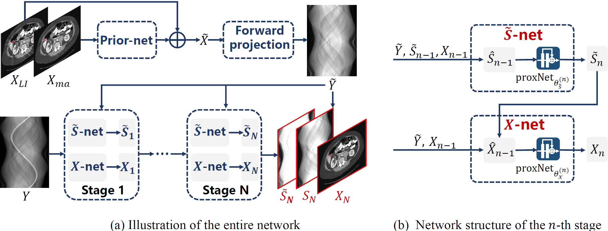
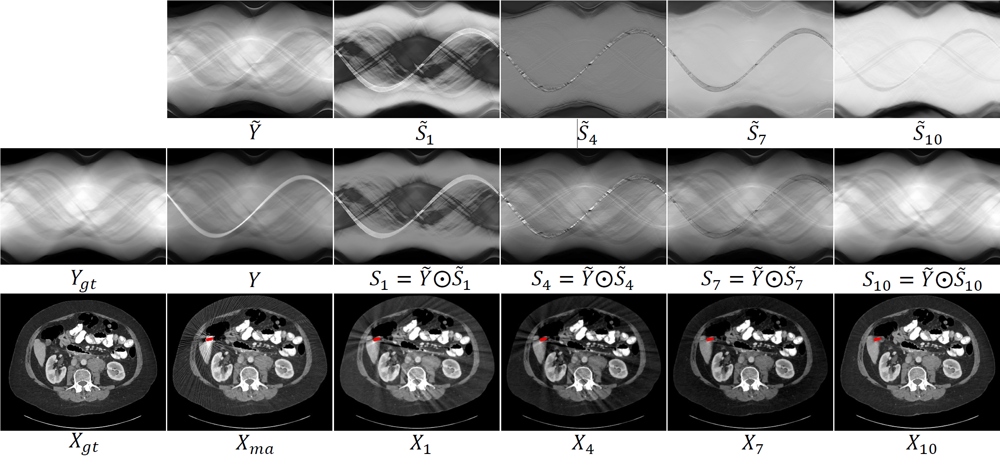
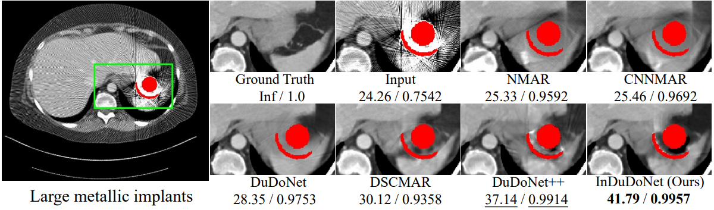
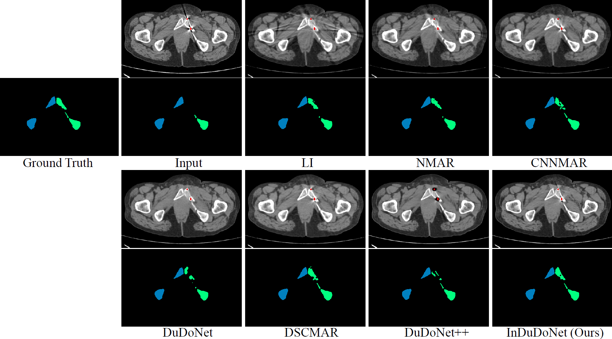

# InDuDoNet: An Interpretable Dual Domain Network for CT Metal Artifact Reduction (MICCAI2021)
[Hong Wang](https://hongwang01.github.io/), Yuexiang Li, Haimiao Zhang, Jiawei Chen, Kai Ma, [Deyu Meng](http://gr.xjtu.edu.cn/web/dymeng), [Yefeng Zheng](https://sites.google.com/site/yefengzheng/)

[[Arxiv&&SM]](https://arxiv.org/pdf/2109.05298.pdf) [[Springer MICCAI2021]](https://link.springer.com/chapter/10.1007/978-3-030-87231-1_11#citeas)

## Abstract
For the task of metal artifact reduction (MAR), although deep learning (DL)-based methods have achieved promising performances, most of them suffer from two problems: 1) the CT imaging geometry constraint is not fully embedded into the network during training, leaving room for further performance improvement; 2) the model interpretability is lack of sufficient consideration. Against these issues, we propose a novel interpretable dual domain network, termed as InDuDoNet, which combines the advantages of model-driven and data-driven methodologies. Specifically, we build a joint spatial and Radon domain reconstruction model and utilize the proximal gradient technique to design an iterative algorithm for solving it. The optimization algorithm only consists of simple computational operators, which facilitate us to correspondingly unfold iterative steps into network modules and thus improve the interpretability of the framework. Extensive experiments on synthesized and clinical data show the superiority of our InDuDoNet.

## Overview of InDuDoNet
<div  align="center"></div>

## Dependicies

Refer to **requirements.txt**. The following project links are needed for installing ODL and astra:

ODL: https://github.com/odlgroup/odl
Astra: https://github.com/astra-toolbox/astra-toolbox


This repository is tested under the following system settings:

Python 3.6

Pytorch 1.4.0

CUDA 10.1

GPU NVIDIA Tesla V100-SMX2

**For running the code,  please first test whether ODL and Astra are both installed correctly. This is quite important.**


## Folder Directory 
```
.
|-- train.py             
|-- test_deeplesion.py
|-- test_clinic.py
|-- results                   # reconstructed images 
|-- network                   # InDuDoNet
|-- deeplesion                # for train and test
|   |-- Dataset.py          
|   |-- __init__.py
|   |-- build_gemotry.py      # imaging paramter (FP/FBP)
|   |-- train                 # synthesized data for train
|   |-- test                  # synthesized data for test
|-- CLINIC_metal              # for clinical evaluation  
|   |-- preprocess_clinic     # processing CLINIC_metal
|   |-- test                  # clinical data for test
```
## Benchmark Dataset

**DeepLesion:** Download the [DeepLesion dataset](https://nihcc.app.box.com/v/DeepLesion).  We use `python` to synthesize the metal-corrupted ones by following the simulation protocol in [1]. The imaging parameters are included in `bulid_geometory.py`. **Please refer to [SynDeepLesion](https://github.com/hongwang01/SynDeepLesion) for downloading the synthesized DeepLesion dataset。**

**CLINIC-metal:** Download the clinical metal-corrupted [CLINIC-metal dataset](https://github.com/ICT-MIRACLE-lab/CTPelvic1K) with mutli-bone segmentation. In our experiments, we only adopt the testing set with 14 volumes for evaluation.
 
## Training
```
CUDA_VISIBLE_DEVICES=0 python train.py --data_path "deeplesion/train/" --log_dir "logs" --model_dir "pretrained_model/"
```

## Testing

### For DeepLesion
```
CUDA_VISIBLE_DEVICES=0 python test_deeplesion.py --data_path deeplesion/test/ --model_dir "pretrained_model/InDuDoNet_latest.pt" --save_path "results/deeplesion/"
```
### For CLINIC-metal
```
CUDA_VISIBLE_DEVICES=0 python test_clinic.py --data_path "CLINIC_metal/test/" --model_dir "pretrained_model/InDuDoNet_latest.pt" --save_path "results/CLINIC_metal/"
```
## Model Verification
<div  align="center"></div>

## Experiments on Synthesized Data
<div  align="center"></div>


## Experiments on CLINIC-metal
<div  align="center"></div>

## Metric
Please refer to [OSCNet](https://github.com/hongwang01/OSCNet/tree/main/metric)

## Acknowledgement
The authors would like to thank [Dr. Lequan Yu](https://yulequan.github.io/) for providing the code `bulid_geometory.py` released in this repository.

## Citations

```
@inproceedings{wang2021indudonet,
  title={InDuDoNet: An Interpretable Dual Domain Network for CT Metal Artifact Reduction},
  author={Wang, Hong and Li, Yuexiang and Zhang, Haimiao and Chen, Jiawei and Ma, Kai and Meng, Deyu and Zheng, Yefeng},
  booktitle={International Conference on Medical Image Computing and Computer-Assisted Intervention},
  pages={107--118},
  year={2021},
  organization={Springer}
}
```
## References

[1] Y.   Zhang   and   H.   Yu,   “Convolutional   neural   network   based   metalartifact  reduction  in  X-ray  computed  tomography,”IEEE  Transactionson Medical Imaging, vol. 37, no. 6, pp. 1370–1381, 2018.


## Contact
If you have any question, please feel free to concat Hong Wang (Email: hongwang01@stu.xjtu.edu.cn)
